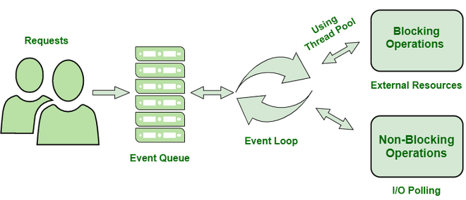

# NodeJS for Noobs

A detailed repo on NodeJS. In this repository you'll find some of the common Node modules and programs being used. This repo can be used for understanding purposes

Install the package and use [Better Comments](https://marketplace.visualstudio.com/items?itemName=aaron-bond.better-comments) extension in VSCode for best experience with comments made to understand specific part of code under the comment


## Installation

First change to the file directory : 

```cd <directory> ```

And then simply run on your terminal : 

``` npm install ```

and it will install all the necessary packages

## How to follow this course : 
- All files and Folders are marked with number so just follow with them
- Some amount of theory can be found in this Readme file
- **Running the scripts in an easy way**

    ```npm run section-<sectionNumber>```

    for example, running *1-BasicResponse.js*

    ```npm run section-1```

## A Brief intro to NodeJS
Node.js is an open-source and cross-platform JavaScript runtime environment. It is a popular tool for almost any kind of project!
It runs the V8 JavaScript engine, the core of Google Chrome, outside of the browser. This allows Node.js to be very performant.

### What NodeJS can do 
- Node.js can generate dynamic page content
- Node.js can create, open, read, write, delete, and close files on the server
- Node.js can collect form data
- Node.js can add, delete, modify data in your database

## Working of NodeJS
 Node.js accepts the request from the clients and sends the response, while working with the request node.js handles them with a single thread. To operate I/O operations or requests node.js use the concept of threads. Thread is a sequence of instructions that the server needs to perform. It runs parallel on the server to provide the information to multiple clients. Node.js is an event loop single-threaded language. It can handle concurrent requests with a single thread without blocking it for one request.

Node.js basically works on two concept

- Asynchronous
- Non-blocking I/O

## Non-blocking I/o

 Non-blocking i/o  means working with multiple requests without blocking the thread for a single request. I/O basically interacts with external systems such as files, databases. Node.js is not used for CPU-intensive work means for calculations, video processing because a single thread cannot handle the CPU works.


## Asynchronous: 
Asynchronous is executing a callback function. The moment we get the response from the other server or database it will execute a callback function. Callback functions are called as soon as some work is finished and this is because the node.js uses an event-driven architecture. The single thread doesn’t work with the request instead it sends the request to another system which resolves the request and it is accessible for another request.

To implement the concept of the system to handle the request  node.js uses the concept of Libuv.

Libuv is an open-source library built-in C. It has a strong focus on asynchronous and  I/O, this gives node access to the underlying computer operating system, file system, and networking.

Libuv implements two extremely important features of node.js  

- Event loop
- Thread pool

### Event loop
In Node.js, the event loop is a piece of the runtime that listens for events and dispatches callbacks to handle those events. It plays a central role in the non-blocking, event-driven I/O model that is the foundation of Node.js.

Here's how the event loop works:

- When a Node.js program starts, the event loop is created and starts running.
- The event loop has a queue of events and callbacks that need to be handled. These events and callbacks are added to the queue by the Node.js runtime, external libraries, and the application code.
- The event loop listens for events and, when one occurs, it adds the corresponding callback to the queue.
- The event loop continually processes the event queue, executing each callback in turn.
- When the queue is empty, the event loop waits for new events to be added, at which point it continues processing the queue.

The event loop is what enables Node.js to be efficient and scalable. It allows the runtime to handle many concurrent events without using up too many resources, by only executing one callback at a time and waiting for I/O operations to complete asynchronously.



## NodeJS Modules
In Node.js, Modules are the blocks of encapsulated code that communicates with an external application on the basis of their related functionality. Modules can be a single file or a collection of multiples files/folders. The reason programmers are heavily reliant on modules is because of their re-usability as well as the ability to break down a complex piece of code into manageable chunks.

Modules are of three types:

- Core Modules
- Local Modules
- Third-party Modules

## The HTTP Module
The http module is a built-in module in Node.js that provides functions for creating an HTTP server or client.

To use the http module, you need to require it in your Node.js script:

const http = require('http');

With the http module, you can create an HTTP server that listens for requests and sends responses, or you can create an HTTP client that makes requests to other servers. 

### Methods to recieve data in NodeJS
In HTTP, the GET, POST, PUT, and DELETE methods are used to retrieve or modify data on a server. These methods are often used in conjunction with HTTP APIs and web applications.

Here's a brief overview of each method:

- GET: The GET method is used to retrieve data from the server. It is the most common HTTP method, and it is used when you enter a URL in your web browser or click on a link.

- POST: The POST method is used to send data to the server, usually to create or update a resource. For example, when you submit a form on a website, the form data is usually sent to the server using the POST method.

- PUT: The PUT method is used to update a resource on the server. It replaces the existing data with the data you send in the request.

- DELETE: The DELETE method is used to delete a resource on the server.

These methods can be used in Node.js by using the http module to create an HTTP server or client, or by using a third-party library like axios or request.

## Project still in development 

###### Credits to __GeeksforGeeks.org__ and ChatGPT